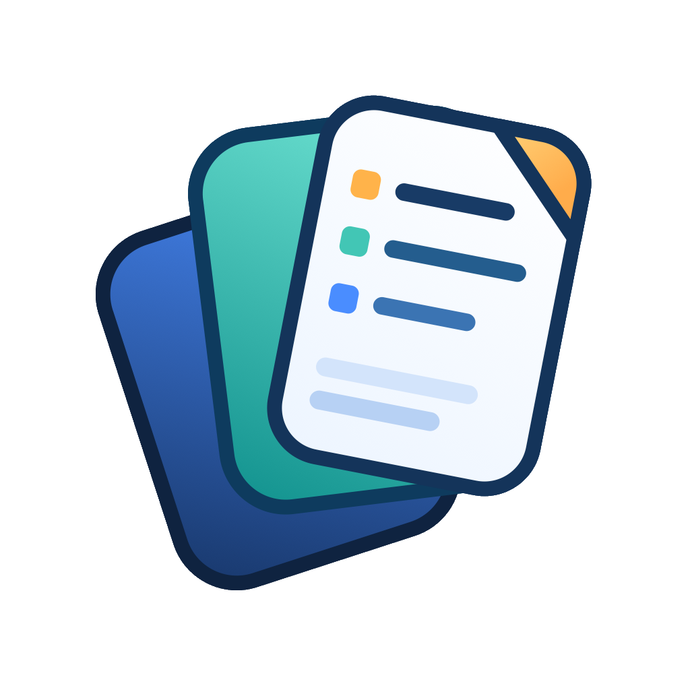

#  Noteeees

[](https://github.com/hidenobunagai/noteeees)

Simple markdown notes extension. Accumulate individual note files and search them instantly via MCP.

## Features

### Moments
A quick-capture timeline panel for fleeting thoughts, tasks, and ideas — always one keypress away.

- **`Cmd+Shift+M`**: Open the Moments panel from the Activity Bar (⚡ lightning icon)
- **Timeline view**: Entries displayed in chronological order with timestamps
- **Quick input**: Type a thought, press `Enter` to save instantly
- **Task mode**: Toggle the `Task` button to create `[ ]` items; click the checkbox to mark done
- **Open-task filter**: Toggle `Open` to focus only on unfinished tasks for the current day
- **Inbox overview**: Open `Inbox` to browse unfinished tasks across all Moments files
- **Date navigation**: Browse previous / next days with `◀ ▶` or jump back to Today
- **Tag highlighting**: `#tag` tokens are rendered as color badges
- **Open in editor**: `↗` opens the day's raw Markdown file for editing

#### Storage format

Each day creates a plain Markdown file at `{NotesDirectory}/moments/YYYY-MM-DD.md`:

```markdown
---
type: moments
date: 2026-03-01
---

- 09:15 Great idea for the API design #idea
- [ ] 10:30 Follow up with the team #todo
- [x] 11:00 Completed task
- 14:22 Interesting article https://example.com
```

Moments are excluded from the regular Notes sidebar but are **fully searchable via MCP** since they're plain `.md` files.

### Individual Notes
- **New Note** (`Cmd+Shift+N`): Create a new markdown note with configurable filename tokens
- **Templates**: Create and use custom templates with VS Code snippets
- **Subfolder Support**: Use `/` in title to auto-create subfolders (e.g., `projects/MyNote`)
- **Search Notes**: Search notes by title, path, or tag from the command palette

### Sidebar
- **Pinned**: Pin frequently used notes from the sidebar context menu
- **Recent**: Browse your latest notes with a configurable item limit
- **Tags**: Open notes grouped by tag, with usage counts in the sidebar and toggle sort order

## Usage

1. Run `Noteeees: Run Setup` to configure the storage directory
2. Press `Cmd+Shift+N` to create a new note
3. Browse notes in the Sidebar

The notes directory is stored in VS Code machine-local settings, so it stays visible in Settings and can be changed there later.

## Templates

Templates use **VS Code snippets**. When you create a new note, the configured snippet is automatically inserted.

### Setup

1. Open Command Palette → `Preferences: Configure Snippets` → `markdown.json`
2. Add your snippets with the `noteeees_template_` prefix:

```json
{
  "noteeees_template_default": {
    "prefix": "noteeees_default",
    "body": [
      "# ${1:${TM_FILENAME_BASE}}",
      "",
      "$0"
    ],
    "description": "Default note template"
  },
  "noteeees_template_meeting": {
    "prefix": "noteeees_meeting",
    "body": [
      "---",
      "tags:",
      "  - meeting",
      "date: \"${CURRENT_YEAR}-${CURRENT_MONTH}-${CURRENT_DATE}\"",
      "---",
      "",
      "# ${1:Meeting Title}",
      "",
      "## Attendees",
      "",
      "- $2",
      "",
      "## Agenda",
      "",
      "- $3",
      "",
      "## Notes",
      "",
      "$0"
    ],
    "description": "Meeting note template"
  }
}
```

3. (Optional) Register custom templates in settings:

```json
{
  "notes.templates": ["meeting"]
}
```

When `notes.templates` is set, a picker will appear on note creation to choose between the default, empty note, and custom templates. If no custom templates are configured, Noteeees creates the note immediately with the default snippet.

## Settings

| Setting | Description |
| --- | --- |
| `notes.notesDirectory` | Directory where notes are stored |
| `notes.defaultNoteTitle` | Filename format (`{dt}_{title}.{ext}`) |
| `notes.noteTitleConvertSpaces` | Character to replace spaces (default: `_`) |
| `notes.defaultSnippet` | Default snippet to insert (`{ langId, name }`) |
| `notes.templates` | Custom template names (maps to `noteeees_template_{name}` snippets) |
| `notes.sidebarRecentLimit` | Number of notes shown in the sidebar Recent section (`0` = all) |
| `notes.sidebarTagSort` | Sort mode for the sidebar Tags section (`frequency` or `alphabetical`) |

## Supercharge with MCP

Turn Noteeees into an external memory for your AI agents (like GitHub Copilot, Claude Desktop, Cursor, etc.) by using the **Model Context Protocol (MCP)**.

This repository includes `notes-mcp/`, an MCP server that exposes your notes to AI agents.

### Setup

1. Build the MCP server:
   ```bash
   cd notes-mcp && bun install && bun run build
   ```

2. Add to your MCP configuration:

**Example (GitHub Copilot `mcp.json`)**:

```json
{
  "servers": {
    "notes-mcp": {
      "type": "stdio",
      "command": "bun",
      "args": ["/path/to/noteeees/notes-mcp/dist/index.js"],
      "env": {
        "NOTES_DIRECTORY": "/path/to/your/notes/directory"
      }
    }
  }
}
```

### Available Tools

| Tool | Description |
| --- | --- |
| `search_notes` | Search across all notes by keyword, tag, or filename. Returns snippet around each match. |
| `get_recent_notes` | Get most recently modified notes (metadata only) |
| `get_notes_by_tag` | Get all notes with a specific tag |
| `get_notes_by_date` | Filter notes by date range (`from`/`to` YYYY-MM-DD) using filename date or mtime |
| `list_notes` | Lightweight metadata-only listing of all notes (filename, title, tags, createdAt, mtime) |
| `list_tags` | List all unique tags with usage counts sorted by frequency |
| `structure_search_notes` | Score-ranked search with tunable weights, recency bonus, and synonym expansion |
| `get_note_content` | Get the full content of a specific note by filename |

### What You Can Do

- **Context Awareness**: "Search my notes for anything about last week's deployment."
- **Tag-based Retrieval**: "Show me all notes tagged #todo."
- **Date-based Lookup**: "Show me notes from January."
- **Smart Search**: Use `structure_search_notes` to get scored results with reasons, synonym expansion (e.g. 経費→精算), and tunable weights.
- **Full Content Access**: Use `get_note_content` to read a specific note in full.

### Tags

Notes support tags in two ways:
- **YAML front matter**: `tags: [todo, meeting]`
- **Inline**: `#todo` anywhere in the note body

