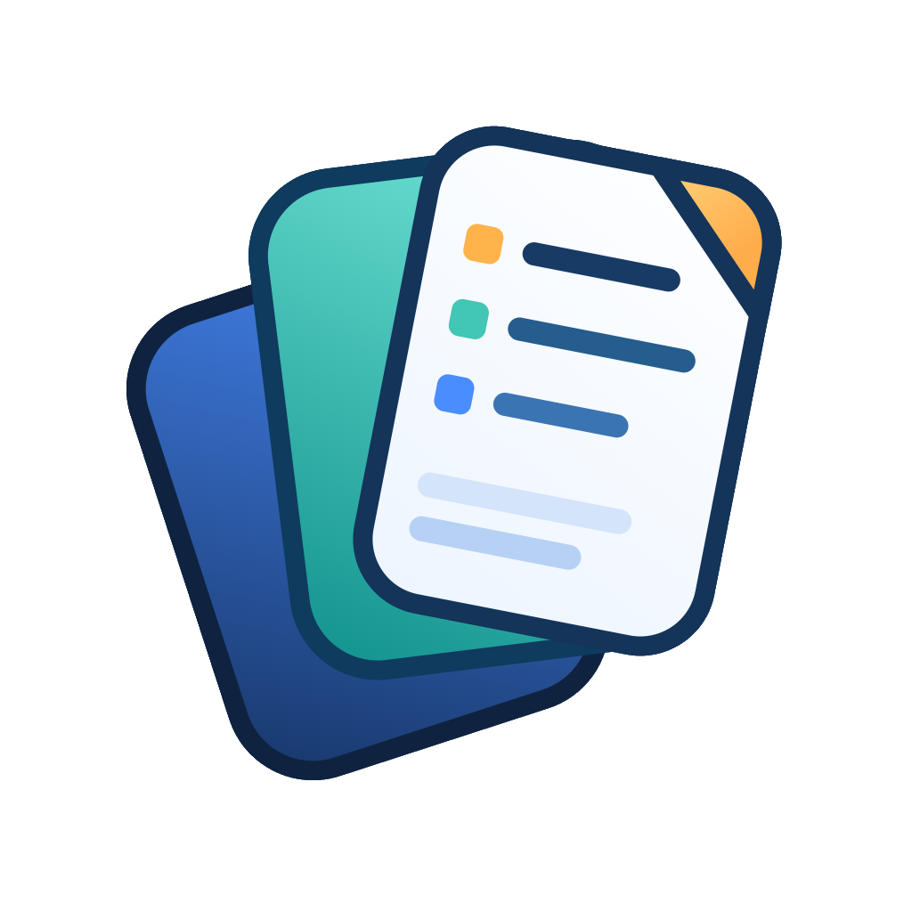

#  Noteeees

[](https://github.com/hidenobunagai/noteeees)

Simple markdown notes extension. Accumulate individual note files and search them instantly via MCP. Elevate rough Moments posts into structured tasks with the built-in Task Dashboard.

## Features

### Task Dashboard
Powered by **GitHub Copilot** (no separate API key required).

- **`Cmd+Shift+T`**: Open the Task Dashboard — a task cockpit for triage, creation, editing, and Moments extraction
- **Task Workspace**: Filter/search across every `- [ ]` / `- [x]` task in your Notes files, grouped into Overdue / Today / Upcoming / Scheduled / Backlog / Done
- **Inline Editing**: Update task text and due dates directly from the dashboard, jump to the source file, or delete a task line without leaving the view
- **Composer**: Add new tasks to `tasks/inbox.md` or any future/past `tasks/YYYY-MM-DD.md` file instead of being limited to today's file
- **Weekly Overview**: Bar chart of open vs done tasks scheduled across the next 7 days
- **Categories**: Task counts broken down by `#work`, `#personal`, `#health`, `#learning`, `#admin`
- **AI Extract**: Let Copilot scan any day's Moments file or notes within a date range for hidden action items, then add the extracted tasks into your chosen destination file
- **Status bar indicator**: Shows `Tasks` in the status bar; updates to a spinner while AI is processing
- **Auto-refresh**: The dashboard refreshes automatically whenever a `.md` file changes in your notes directory

#### Dashboard commands

| Command | Description |
| --- | --- |
| `Noteeees: Open Task Dashboard` (`Cmd+Shift+T`) | Open or reveal the dashboard panel |
| `Noteeees: AI - Extract Tasks from Today's Moments` | Open dashboard and run AI Extract |

### Moments
A quick-capture timeline panel for fleeting thoughts and ideas — always one keypress away.

- **`Cmd+Shift+M`**: Open the Moments panel from the Activity Bar (⚡ lightning icon)
- **Timeline view**: Entries displayed as a continuous recent feed with timestamps and quick actions
- **Quick input**: The composer stays pinned below the topbar so you can type immediately; press `Enter` to save instantly, or use `Shift+Enter` for multiline posts
- **Inline editing**: Edit a Moment in place and save without leaving the panel
- **Safe deletion**: Delete a Moment from the panel with a confirmation step
- **Sticky date markers**: Each day label stays visible while you scroll through the feed
- **Hashtag feed filters**: Click a `#tag` in Moments to filter the current feed to that hashtag, then clear it from the header
- **Open in editor**: `↗` opens today's raw Markdown file for editing

#### Storage format

Each day creates a plain Markdown file at `{NotesDirectory}/moments/YYYY-MM-DD.md`:

```markdown
---
type: moments
date: 2026-03-01
---

- 09:15 Started working on the API design #work
- 10:30 Need to follow up with the team
- 14:22 Interesting article https://example.com
```

Moments are excluded from the regular Notes sidebar but are **fully searchable via MCP** since they're plain `.md` files. Use **AI Extract** in the dashboard to turn your free-form posts into actionable tasks.

### Daily Note
- **Daily Note** (`Cmd+Shift+D`): Open today's daily note — creates it from a template if it doesn't exist. File is saved as `YYYY-MM-DD_daily.md` in your notes directory root. Customize the template with `notes.dailyNoteTemplate` (supports `{date}`, `{weekday}`, `{time}` tokens).

### Individual Notes
- **New Note** (`Cmd+Shift+N`): Create a new markdown note with configurable filename tokens
- **Templates**: Create and use custom templates with VS Code snippets
- **Subfolder Support**: Use `/` in title to auto-create subfolders (e.g., `projects/MyNote`)
- **Search Notes**: Search notes by title, path, or tag from the command palette
- **Preview-rich search**: Search results include timestamps, tags, and query-aware content excerpts so matches are easier to scan

### Sidebar
- **Pinned**: Pin frequently used notes from the sidebar context menu
- **Pinned ordering**: Move pinned notes up or down from the sidebar context menu or with `Cmd+Opt+↑ / ↓`
- **Recent**: Browse your latest notes with a configurable item limit
- **Tags**: Open notes grouped by tag, with usage counts and latest-note context in the sidebar, scan tag-aware excerpts inside each tag group, toggle sort order, search tags directly, and preview likely matches before opening a note

## Architecture

Noteeees is designed as an offline-first, high-performance VS Code extension with dedicated webview panels and integrated GitHub Copilot AI intelligence:

<p align="center">
  
  
</p>

👉 **[Explore the Interactive Architecture Diagram (HTML)](docs/architecture.html)** *(Supports theme toggle, interactive guided views, pan/zoom, and export)*

## Usage

1. Run `Noteeees: Run Setup` to configure the storage directory
2. Press `Cmd+Shift+N` to create a new note
3. Browse notes in the Sidebar

The notes directory selected by `Run Setup` is stored in extension-local machine storage, so you only need to choose it once per machine and it does not bounce across your devices through synced settings. If you need a workspace-specific override, set `notes.workspaceNotesDirectory` in workspace settings. `notes.notesDirectory` remains only as a legacy fallback for older setups.

### Tags

Notes support tags in two ways:
- **YAML front matter**: `tags: [todo, meeting]`
- **Inline**: `#todo` anywhere in the note body

## Templates

Templates use **VS Code snippets**. When you create a new note, the configured snippet is automatically inserted.

### Setup

1. Open Command Palette → `Preferences: Configure Snippets` → `markdown.json`
2. Add your snippets with the `noteeees_template_` prefix:

```json
{
  "noteeees_template_default": {
    "prefix": "noteeees_default",
    "body": [
      "# ${1:${TM_FILENAME_BASE}}",
      "",
      "$0"
    ],
    "description": "Default note template"
  },
  "noteeees_template_meeting": {
    "prefix": "noteeees_meeting",
    "body": [
      "---",
      "tags:",
      "  - meeting",
      "date: \"${CURRENT_YEAR}-${CURRENT_MONTH}-${CURRENT_DATE}\"",
      "---",
      "",
      "# ${1:Meeting Title}",
      "",
      "## Attendees",
      "",
      "- $2",
      "",
      "## Agenda",
      "",
      "- $3",
      "",
      "## Notes",
      "",
      "$0"
    ],
    "description": "Meeting note template"
  }
}
```

3. (Optional) Register custom templates in settings:

```json
{
  "notes.templates": ["meeting"]
}
```

When `notes.templates` is set, a picker will appear on note creation to choose between the default, empty note, and custom templates. If no custom templates are configured, Noteeees creates the note immediately with the default snippet.

## Settings

| Setting | Description |
| --- | --- |
| `notes.notesDirectory` | Legacy fallback only. Older synced values can still be imported, but `Run Setup` now stores the directory in local extension storage. |
| `notes.workspaceNotesDirectory` | Workspace-specific notes directory override. When set, it wins over the machine-global notes directory for the current workspace. |
| `notes.defaultNoteTitle` | Filename format (`{dt}_{title}.{ext}`) |
| `notes.noteTitleConvertSpaces` | Character to replace spaces (default: `_`) |
| `notes.defaultSnippet` | Default snippet to insert (`{ langId, name }`) |
| `notes.templates` | Custom template names (maps to `noteeees_template_{name}` snippets) |
| `notes.sidebarRecentLimit` | Number of notes shown in the sidebar Recent section (`0` = all) |
| `notes.sidebarTagSort` | Sort mode for the sidebar Tags section (`frequency` or `alphabetical`) |
| `notes.momentsInboxFilter` | Default filter for the Moments Inbox (`all`, `open`, or `done`) |
| `notes.momentsFeedDays` | Number of days shown in the stacked Moments feed (`1`-`30`) |
| `notes.ai.autoEnrich` | Auto-run AI task enrichment on file save (requires GitHub Copilot) |
| `notes.statusBarTasks` | Show the `Tasks` status bar item that opens the Task Dashboard (`true` by default) |
| `notes.locale` | UI language for webviews and notifications: `auto` (follows VS Code), `en`, or `ja` |
